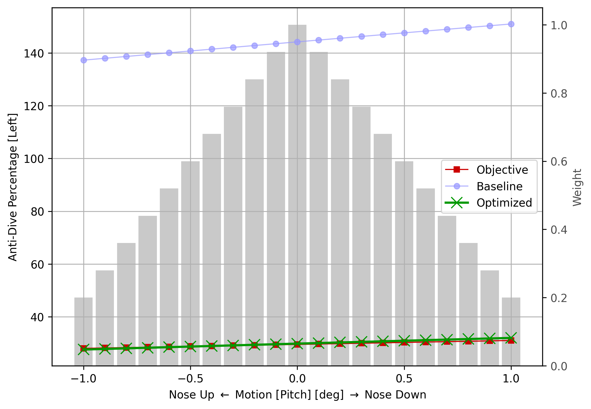
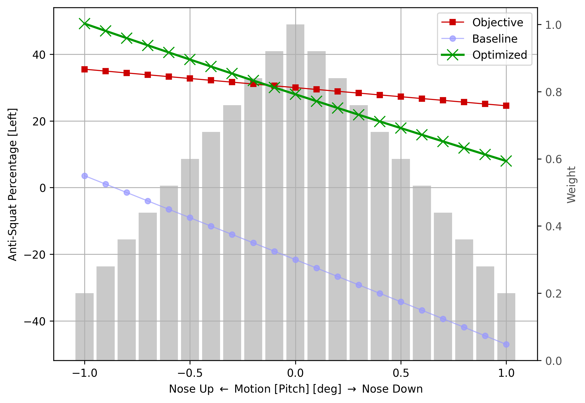

# Multi-Objective Optimization of Suspension Kinematics

This page presents extra material obtained in the case study presented on conference paper 238 - Multi-Objective 
Optimization of Suspension Kinematics of a Race Car, published* in [IAVSD 2021](https://iavsd2021.ru/).

(*) Full paper submitted, publication confirmation pending.

Authors:
- [Ariel Avi](https://www.linkedin.com/in/aviariel/)
- [Claude Rouelle](https://www.linkedin.com/in/claude-rouelle-1810409/)
- [Andrea Piga Carboni](https://www.linkedin.com/in/andrea-piga-carboni-032706180/)

## Overview

The optimization was run on a AWS c5a.8xlarge Ubuntu instance, running on 32 parallel threads. The total time needed 
to run the 4000 generations was approximately 9 hours and 42 minutes. The genetic algorithm settings were:
- Maximum generations: 4000
- Population size: 300
- Mutation rate: 5%
- Mutation method: Gaussian mutation, 2mm standard deviation
- Crossover method: Voluminal BLX-alpha, alpha=2$
- Selection for reproduction: Ranked, 1 rank per generation
- Selection for replacement: Truncation, 150 individuals per generation

## Baseline Suspension

The baseline system uses a Double A-Arm suspension on the front axle and a Five Links on the rear axle.

Fig. 1 - Baseline Suspension: Front View

Fig. 2 - Baseline Suspension: Isometric View

Fig. 3 - Baseline Suspension: Side View

Fig. 4 - Baseline Suspension: Top View

Fig. 5 - Baseline Suspension: Front axle on front view

Fig. 6 - Baseline Suspension: Rear axle on front view

## Optimization

### Boundaries

The boundaries for this case study were chosen arbitrarily, based on experience and were set to large values in order 
to prove that the optimization algorithm can still cope with big search spaces. More details are presented on the paper
itself.

Spherical shapes were used as the outboard boundaries while box shapes were used in the inner boundaries. Each color
represents a different suspension link - or body. The system shown in the boundaries images is the baseline
configuration.

Fig. 7 - Boundaries - Front View

Fig. 8 - Boundaries - Rear View

Fig. 9 - Boundaries - Isometric View

Fig. 10 - Boundaries - Side View

Fig. 11 - Boundaries - Top View

### Objective functions

The objective functions are divided between several evaluation motions. An evaluation motion is the motion that 
defines how the the individual should be evaluated (heave, roll, pitch, steering, or a combination of them). The
objectives are shown preceeded by their respective evaluation motions, following the pattern \<Motion\> : 
\<Objective\>.

The evaluations were given in the form:
- Heave: from -30mm to +30mm displacement w.r.t. the static position.
- Roll: from -3deg to +3deg, with the axis of rotation set fixed, given by the line that connects the points
A(1, 0, 0) and B(-1, 0, 0).
- Pitch: from -1deg to +1deg, with the axis of rotation set fixed, given by the line that connects the points
A(0, 1, 0) and B(0, -1, 0).
- Steering: from -270deg to +270deg at the steering wheel with a rack ratio (mm/revolution) of 60.40.

Fig. 12 - Heave: Half Track (Front Left)

Fig. 13 - Heave: Half Track (Rear Left)

Fig. 14 - Heave: Toe Angle (Front Left)

Fig. 15 - Heave: Toe Angle (Rear Left)

Fig. 16 - Heave: Roll Center Z (Front)

Fig. 17 - Heave: Roll Center Z (Rear)

Fig. 18 - Heave: Mechanical Trail (Front Left)

Fig. 19 - Heave: Scrub Radius (Front Left)

Fig. 20 - Roll: Camber Angle (Front Left)

Fig. 21 - Roll: Camber Angle (Rear Left)

Fig. 22 - Roll: Roll Center Y (Front)

Fig. 23 - Roll: Roll Center Y (Rear)

Fig. 24 - Pitch: Anti-Dive Percentage

Fig. 25 - Roll: Anti-Squat Percentage

Fig. 26 - Roll: Anti-Lift Percentage (Rear)

Fig. 27 - Steering: Camber Angle (Front Left)

Fig. 28 - Steering: Ackerman Angle (Front)

Fig. 29 - Steering: Steering Ratio

### Resulting system

The resulting sytem geometries are shown below in several pictures.

Fig. 30 - Optimized Suspension: Front View

Fig. 31 - Optimized Suspension: Isometric View

Fig. 31 - Optimized Suspension: Side View

Fig. 33 - Optimized Suspension: Top View

Fig. 34 - Optimized Suspension: Front axle on front view

Fig. 35 - Optimized Suspension: Rear axle on front view

### Statistical results

The optimization statistical results are shown below.

Fig. 36 - Average fitness distribution per objective of the final population

Fig. 37 - Convergence statistics

